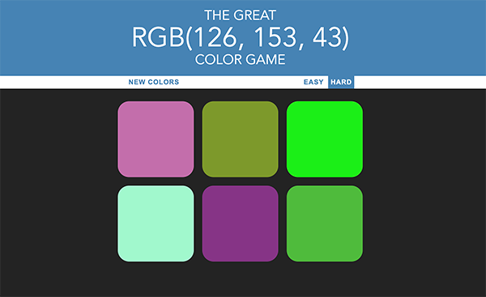

## The Great RGB Guessing Game!

[Link to Live Game](https://vivgarcia.github.io/rgb-guessing-game/)

### How to Play

There are two different levels: Easy and Hard.

Easy will give you three options and Hard will give you six.

The RGB color code will appear in the header.
Click the square you think matches the RGB color code. 
If you guess wrong, the square will disappear.
If you're correct, all the squares will turn the correct color.
 

### Technology Used

* HTML
* CSS
* JavaScript

### Future Development

* Rebuild with React
